Today!
===

*   Version Control Systems
    *   Local
    *   Centralized
    *   Distributed
*   Git
    *   Essentials
    *   Step-by-step example
    *   Files
    *   Branches

<!-- end_slide -->
<!-- jump_to_middle -->
THIS IS A NEW SECTION!
===
<!-- end_slide -->

INTRODUCTION TO VERSION CONTROL SYSTEMS
===

What is version control?
> Version control is a system (abbreviated VCS) that records changes to a file or set of files over time so that you can recall specific versions later.

VCS is absolutely **essential** if you plan on developing serious software (academic and industry standard).
Working on a software project without VCS simply does not scale. The project is doomed to fail.

_Disclaimer: Some content and figures in these slides are based on the free Pro Git book written by Scott Chacon and Ben Straub._

<!-- end_slide -->

WHY VCS IS A REQUIREMENT
===

*   Every change you commit is tracked (author, time, changelog)
*   You can easily revert changes
*   The VCS allows you to bisect your commits in case you need to isolate a bug (e.g. `git-bisect`)
*   You know exactly when, where and who introduced what changes. This is crucial in large projects with many developers.

<!-- end_slide -->

LOCAL VERSION CONTROL
===
<!-- column_layout: [3, 2] -->

<!-- column: 0 -->
If you only need version control on your local machine (e.g., laptop), you will probably make backup copies of your files into some directory you dedicate for VCS.

<!-- column: 1 -->

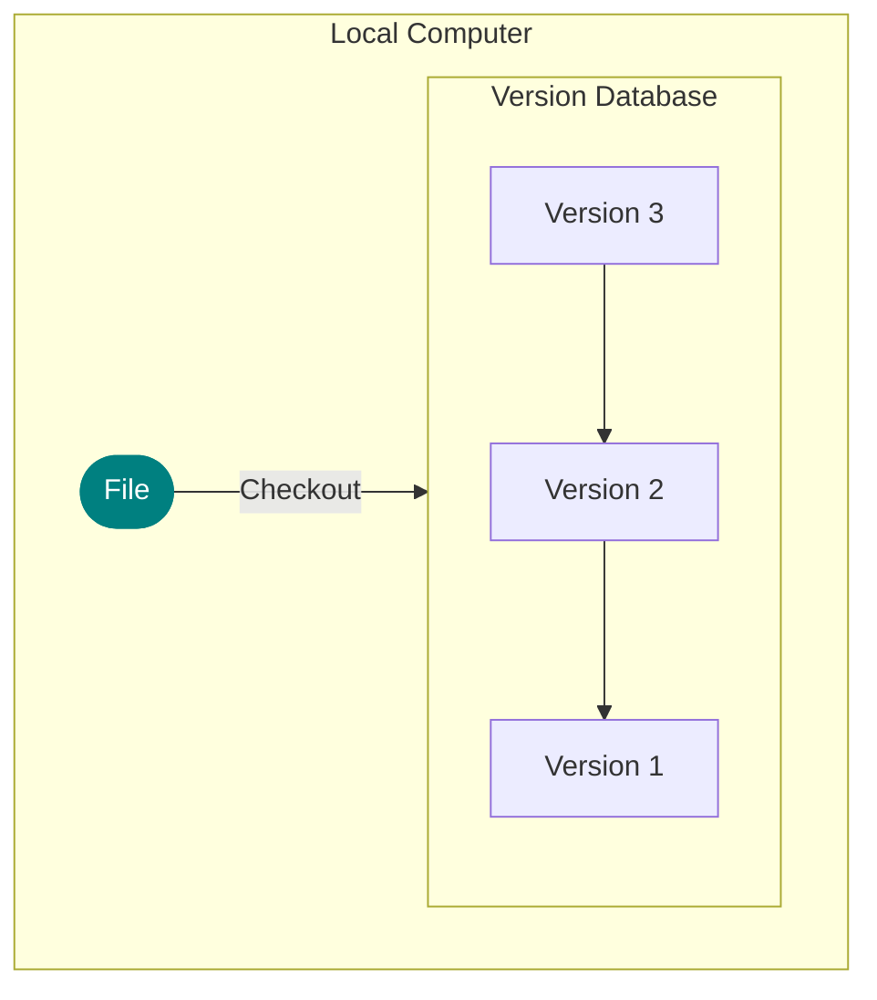

<!-- reset_layout -->
```latex +render
\[ \sum_{n=1}^{\infty} 2^{-n} = 1 \]
```
<!-- end_slide -->

CENTRALIZED VCS MODEL (CLIENT-SERVER)
===

_Diagram Suggestion (Mermaid or ASCII):_
_Two boxes "Computer A" and "Computer B", each with a "File". Both point to a central box "Central VCS Server" which contains a "Version Database" (linear chain like before). Arrows indicate checkout/commit flow._

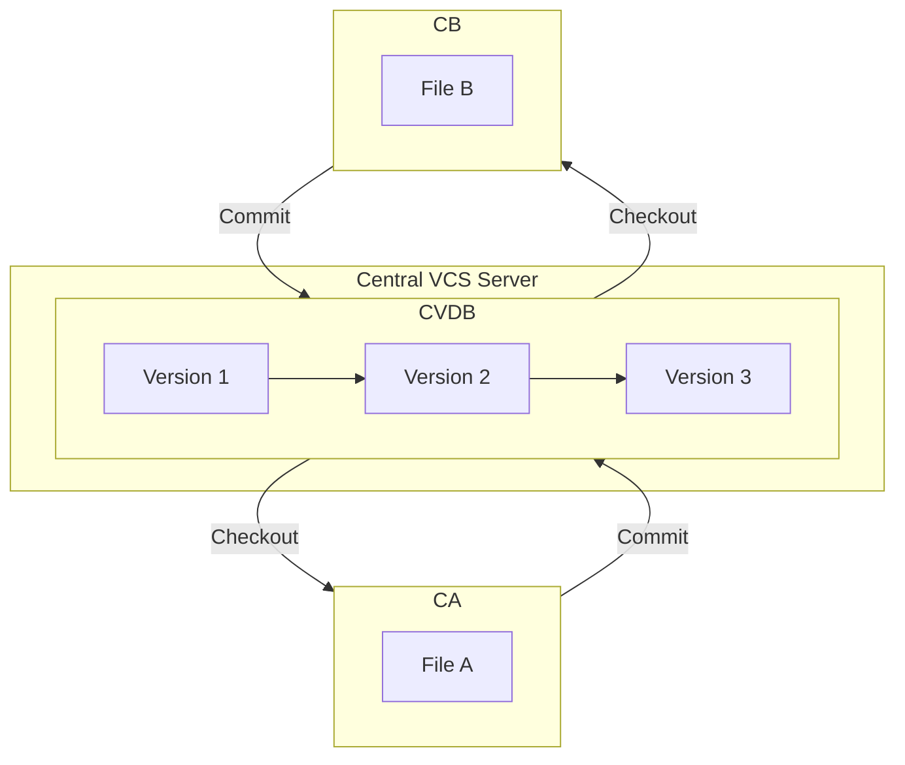

Instead of hosting the VCS database locally it is hosted on a **central server**.
*   Administrators have fine grained control over access rights and policies.
*   Everyone knows to a certain degree what everyone else does.

<!-- end_slide -->

CENTRALIZED VCS MODEL (CLIENT-SERVER) - Workflow
===

Workflow in a centralized VCS:
A developer is checking out a file to do work on.
_What should be the policy for other developers who want to checkout the same file?_

*   **File locking:** local read-only, write access through locking.
*   **Version merging:** local read- and write-access, conflicts resolved through merging algorithms.

After the work is done, the changes are committed and checked-in on the central repository:
*   **File locking:** the check-in process is trivial. The updated file is simply added. (What is the main drawback?)
*   **Version merging:** if multiple developers modified the same file, individual changes must be merged. Expensive operation for chunks of changes and difficult to resolve automatically.

<!-- end_slide -->

CENTRALIZED VCS MODEL (CLIENT-SERVER) - Drawbacks
===

_Diagram: Same as previous Centralized VCS slide._

*   **Single server instance.** If the server does down (e.g. a fire), you better have a backup somewhere else!
*   During server downtime (or you are offline), you can not work on the project!
*   **Branching** for features testing and implementation is not trivial in CVCS.
*   Resolving merge conflicts can be an expensive problem due to the sequential nature of the CVCS model.

<!-- end_slide -->

DISTRIBUTED VCS MODEL
===

_Diagram Suggestion (Mermaid or ASCII):_
_A central "Server Computer" with its "Version Database". "Computer A" and "Computer B" are peers, each with its *own full copy* of "Version Database". Arrows show synchronization between all three._

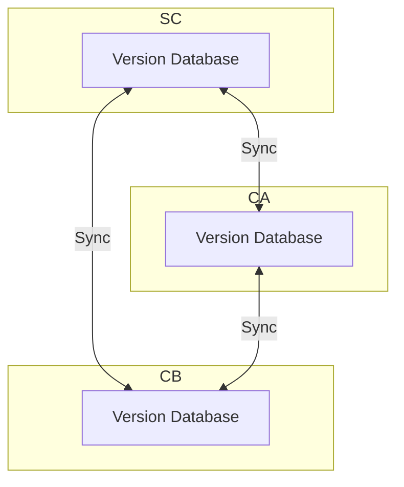

*   Clients do not only checkout the latest snapshot but **mirror the full repository**.
*   If a server instance goes down, everybody has a backup locally.
*   It allows you to work completely offline.
*   Allowing for multiple server instances (remote) is trivial.

<!-- end_slide -->

DISTRIBUTED VCS MODEL - Workflow
===

Workflow in a distributed VCS:
1.  A developer **clones** a repository if it does not exist locally yet.
2.  Modifications are committed on the **local** repository. There are two ways these commits can be distributed to collaborators:
    *   Sending **patches** to collaborators via email.
    *   Hosting the repository on a public remote, where commits can be pushed to or pulled from. This workflow does not originate from Git itself but was introduced by platforms such as GitHub and GitLab.
        *   To prevent unauthorized pushes to a remote, the **fork** and **pull-request** model is used on these platforms.

<!-- end_slide -->

ENTER GIT
===

<!-- end_slide -->

WHY GIT?
===

We have seen that there are many alternative VCS. The reason Git exists is because of the Linux kernel development:
*   The Linux kernel is a very **large** project
*   There are many contributors developing in **parallel**
*   On many different (feature) **branches**

> Linus Torvalds created Git.

<!-- end_slide -->

WHY GIT? (Cont.)
===

The characteristics of the Linux kernel project therefore have the following VCS requirements:
*   The VCS must be **fast**
*   It must have a **simple design**
*   Strong support for **non-linear development** (thousands of parallel branches)
*   **Fully distributed**
*   Ability to handle **large projects efficiently** in terms of speed and data size

These are all features implemented in Git version control system. And it is open-source of course.

<!-- end_slide -->

THE ESSENTIALS OF GIT - Configuration
===

Before we start:
Ensure your contact information is setup correctly.
Every commit contains the author information with an email address.
All the global Git customization is been done in the file `~/.gitconfig`
Verify the file exists and you have at least the following lines of code:

```ini
[user]
  name = FirstName LastName
  email = you@domain.com
[core]
  editor = vim ; and possibly this for a preferred editor (otherwise defaults to system)
```

<!-- end_slide -->

THE ESSENTIALS OF GIT - Data as Snapshots
===

> Git sees its data not as individual files but as a whole system. It stores the state of the full file system for a particular instant in time.

*   Such a frozen state is called a **snapshot**.
*   Think of it as if Git is taking a picture of all your files every time you create a commit.
*   If a file has not changed Git will not store it again but simply add a **reference** to the already stored file.

<!-- end_slide -->

THE ESSENTIALS OF GIT - Versioning
===

The way Git treats data for versioning:

_Diagram Description: A timeline "Checkins Over Time"._
_Version 1: File A, File B, File C_
_Version 2: File A (A1 - changed), File B (B - same), File C (C1 - changed)_
_Version 3: File A (A1 - same), File B (B - same), File C (C2 - changed)_
_Version 4: File A (A2 - changed), File B (B1 - changed), File C (C2 - same)_
_Version 5: File A (A2 - same), File B (B2 - changed), File C (C3 - changed)_
_Dashed lines should connect unchanged files between versions._

Storing data as a stream of **snapshots**: each vertical version is a snapshot of the complete file system within the repository.
Dashed lines indicate references to the file of the previous version because the file has not changed.

<!-- end_slide -->

THE ESSENTIALS OF GIT - Hashes
===

> Git *does not* reference its files by name!

*   Everything in Git is referenced by **hashes**. Internally, Git uses the **SHA-1** hashing algorithm for this.
*   These hashes look similar to something like this: `05682360767630528cc5188a81f88d5e64711608`
*   A hash is **uniquely** determined given the content of a file.
*   This means that changes in file state you commit are **final** once they are shared on a public remote.

<!-- end_slide -->

THE ESSENTIALS OF GIT - Fundamental Objects
===

There are three fundamental objects in Git:
*   **Blobs**: encode the contents of files in your repository.
*   **Trees**: model a (directory) hierarchy similar to the hierarchical Unix file system. The leaves of trees hold either blobs or other trees.
*   **Commits**: contain one tree and they store references to one or more parent commits. A branch, therefore, is nothing more than a sequence of commits and it can be referenced by the most recent commit.

---
*   A **blob** is the fundamental data unit in Git. Everything about Git is about how blobs are managed.
*   Trees and commits are just high-level structures to manage blobs.
*   All of these objects are hashed and identified with the unique hash value. These hashed objects are stored in `.git/objects`.

<!-- end_slide -->

THE ESSENTIALS OF GIT - Anatomy of a Commit
===

The anatomy of Git

_Diagram Description:_
_Left: Example repository structure:_
```
.
├── lib
│   └── simplegit.rb
├── Rakefile
└── README
```
_Right: Corresponding Git commit structure:_
_A "tree" object at the top. It points to "README" (blob), "Rakefile" (blob), and "lib" (another tree object). The "lib" tree object points to "simplegit.rb" (blob)._

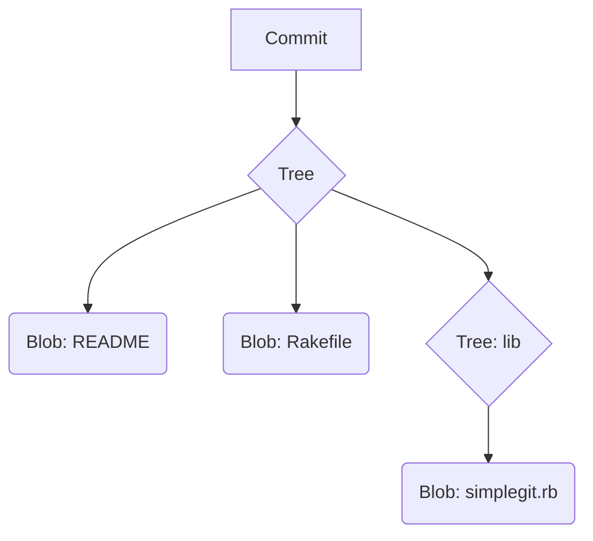

A **blob** is the fundamental data unit in Git. Everything about Git is about how blobs are managed.
Trees and commits are just high-level structures to manage blobs.

Highly recommended reading: [Git From the Bottom Up](https://jwiegley.github.io/git-from-the-bottom-up)

<!-- end_slide -->

THE ESSENTIALS OF GIT - File States & Areas
===

The anatomy of Git:
The previous slides were addressing low-level concepts in Git.
Understanding them makes working with Git on the high-level simpler.

There are **three file states** in Git that are important to understand:
1.  **modified**: you have changed the file but not committed to your local database.
2.  **staged**: you have marked a modified file to go into your next commit snapshot.
3.  **committed**: the data is safely stored in your local database (SHA-1 hash is computed).

These states apply to files that are **tracked** by Git (under version control).
Files not marked for version control (and not ignored by Git either) are indicated as **untracked** files in Git.

<!-- end_slide -->

THE ESSENTIALS OF GIT - Repository Sections
===

This leads to three main sections in a Git repository:
1.  The **working tree** where you checkout and **modify** files
    *   Holds the human readable contents of a decompressed snapshot (Git stores data using compression algorithms)
    *   If you have a branch checked out, the files you see are in your working tree.
2.  The **staging area** where you put your **staged** files (also referred to as **index**)
    *   The staging area is simply a file inside the `.git` directory called `index`
    *   You selectively add changes to the index that you plan for the **next commit**
    *   You should add logical, small changes at a time. If you are faced with a larger problem, divide it into smaller sub-problems and go step-by-step.
3.  The **`.git` directory** is where your **commit history** lives (i.e. the Git repository)
    *   This is where Git stores metadata and the object database for your project.
        **When you remove it, you lose all your version control.**
    *   It is the heartbeat of Git and the data that is copied from a remote when you clone a project.

<!-- end_slide -->

THE ESSENTIALS OF GIT - Workflow Diagram
===

This leads to three main sections in a Git repository:

_Diagram Description: Three vertical lanes: "Working Directory", "Staging Area", ".git directory (Repository)"._
_Arrow from Staging Area to Working Directory (pointing left): "Checkout the project"._
_Arrow from Working Directory to Staging Area (pointing right): "Stage Fixes" (or `git add`)._
_Arrow from Staging Area to .git directory (pointing right): "Commit" (or `git commit`)._

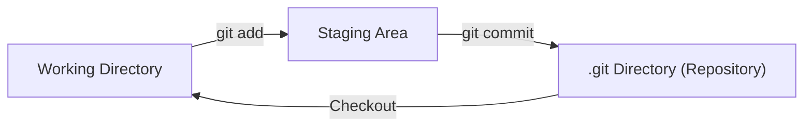

The three main sections a certain change traverses in Git and how information flows.

<!-- end_slide -->

STEP BY STEP GIT EXAMPLE - Main Steps Overview
===

Main steps:
1.  Obtain a `.git` directory: `git init` / `git clone`
2.  Check the status: `git status`
3.  Add new or modified files to the index: `git add`
4.  Commit staged changes to the repository: `git commit` / `git commit -a`
5.  Push the commits to the remote repository: `git push`
6.  Synchronize with the remote: `git fetch` / `git merge` (or `git pull`)
7.  Inspect history: `git log`

<!-- end_slide -->

STEP BY STEP GIT EXAMPLE - Step 1: `git init` / `git clone`
===

Step 1: Obtain a `.git` directory. Create or clone a repo.
*   `git init`: Initializes a new, empty Git repository in the current directory. Creates the `.git` subdirectory.
*   `git clone <url>`: Copies an existing Git repository from a remote URL to your local machine, including all history and branches. Also creates the `.git` subdirectory.

_Diagram: World/Cloud icon ("Remote Repository") with an arrow pointing left to "Working Directory", labeled "git clone via http(s), ssh or local repo". The Working Directory also implicitly contains/creates the ".git directory (Repository)" and a "Staging Area"._

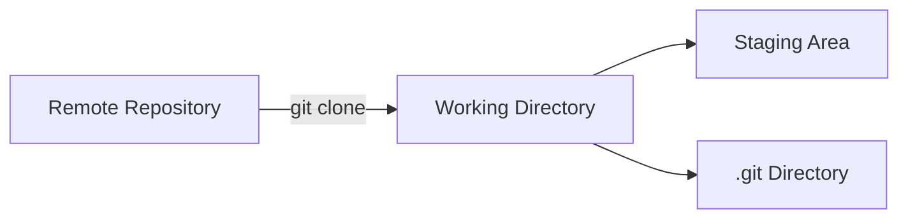

<!-- end_slide -->

STEP BY STEP GIT EXAMPLE - Step 2: `git status`
===

Step 2: Check the status
```bash
git status
```
_Diagram: Focus on "Working Directory". An action "git status" is performed, inspecting it._

*   Shows the state of the working directory and the staging area.
*   Lets you see which changes have been staged, which haven't, and which files aren't being tracked by Git.
*   One of the most frequently used Git commands.

<!-- end_slide -->

STEP BY STEP GIT EXAMPLE - Step 3: `git add`
===

Step 3: Add new or modified files to the index (staging area)
```bash
git add <file_name>
git add .  # Adds all changes in the current directory and subdirectories
```
_Diagram: Arrow from "Working Directory" to "Staging Area", labeled "git add"._

> New or changed files are added to the **index** also known as the **staging area**.
> Files in the staging area will go into the next commit.

<!-- end_slide -->

STEP BY STEP GIT EXAMPLE - Step 4: `git commit`
===

Step 4: Commit staged changes to the repository
```bash
git commit -m "Your descriptive commit message"
```
_Diagram: Arrow from "Staging Area" to ".git directory (Repository)", labeled "git commit"._

> Staged changes are committed to the **repository**. This creates a new snapshot.

Using `git commit -a`:
```bash
git commit -a -m "Commit all tracked, modified files"
```
`git commit -a` is a shortcut to automatically stage all *tracked* files that are *modified* or *deleted* in the working directory, and then commit them. This omits the explicit `git add` step for these files. (Does not add *new* untracked files).

<!-- end_slide -->

STEP BY STEP GIT EXAMPLE - Step 5: `git push`
===

Step 5: Push the commits to the remote repository
```bash
git push <remote_name> <branch_name>
git push origin main  # Common example
```
_Diagram: Arrow from local ".git directory (Repository)" to "Remote Repository", labeled "git push"._

*   Uploads local branch commits to the specified remote repository.
*   Shares your changes with others.

<!-- end_slide -->

STEP BY STEP GIT EXAMPLE - Step 6: Sync with Remote (`fetch`, `merge`, `pull`)
===

Step 6: Synchronize with the remote.

**`git fetch <remote_name>`**
_Diagram: Arrow from "Remote Repository" to local ".git directory (Repository)", labeled "git fetch"._
> `git fetch` will download changes from the remote to your local `.git` directory (updates remote-tracking branches), but **not** update your local working directory or local branches.

**`git merge <branch_to_merge_from>`** (e.g., `git merge origin/main`)
_Diagram: Arrow from ".git directory (Repository)" (specifically the fetched remote-tracking branch) to "Working Directory", labeled "git merge"._
> `git merge` will update the current local branch (and working directory) by combining it with changes from another branch (e.g., a fetched remote-tracking branch).

**`git pull <remote_name> <branch_name>`**
_Diagram: Arrow from "Remote Repository" directly to "Working Directory", encompassing both fetch and merge stages. Labeled "git pull"._
> `git pull` updates the local working directory. It is a `git fetch` followed by a `git merge` (or rebase, depending on configuration) in sequence.

<!-- end_slide -->

STEP BY STEP GIT EXAMPLE - Step 7: `git log`
===

Step 7: Inspect the history of commits contributed by you and others
```bash
git log
git log --oneline --graph --decorate --all # A very useful alias
```
Shows commit history. Many options to filter and format the output.

**Searching the Git history:**
*   `--grep=<pattern>`: Search commit messages for a regex pattern.
*   `--author=<pattern>`: Search for commits by a specific author (regex).
*   If you use `--grep` multiple times, any pattern may match.
*   If you want *all patterns must match*, pass the `--all-match` option.

<!-- end_slide -->

A NOTE ON REMOTE REPOSITORIES
===

The remote can be a server from GitHub, for example, but it can also be **local** on your computer (e.g., another directory). Git does not really care about the "where".

You can list the remotes with `git remote show` or `git remote -v`.
*   You can add as many remotes as you like (`git remote add <name> <url>`).
*   If you do not setup a tracking branch for `git push`, then you must be explicit and tell Git which remote you to use and which branch to push (same is true for `git pull`).
    *   `git push -u origin main` (the `-u` sets up tracking for future pushes/pulls on this branch).
*   On GitHub you can choose to use `https` or `ssh` (prefer `ssh` for frequent use) to communicate with a remote.

<!-- end_slide -->

HOW OFTEN SHOULD YOU COMMIT CHANGES?
===

> **Remember:** in your *local* repo, you can be messy and clean up later if you are not sure yet where it is going (before pushing to a shared remote).

*   If you are working on something complex, it may make sense to commit very frequently, such that you can keep track of the impact of your changes (micro commits).
*   You can always **reorder** and **combine** local commits (e.g., with interactive rebase: `git rebase -i`) *before you push them to a remote where others have access too*.
*   Committing once or twice a day is too few. Your commits will be bulky and it will be difficult to **bisect** if you introduced a bug.

> Commits that you intend to push should **always build the code correctly** (if you work with a compiled language) and **pass all your unit tests**. This will help you avoid trouble in the long run. We will see in later lectures how this process is automated (CI/CD).

<!-- end_slide -->

QUESTIONS SO FAR?
===

<!-- end_slide -->

UNDERSTAND THE STATUS OF YOUR FILES
===

_Diagram: A flowchart showing file lifecycle:_
_Untracked -> (Add the file) -> Unmodified (in Staging Area & .git dir)_
_Unmodified -> (Edit the file) -> Modified (in Working Directory)_
_Modified -> (Stage the file / `git add`) -> Staged (in Staging Area)_
_Staged -> (Commit / `git commit`) -> Unmodified (in .git dir, snapshot taken)_
_Unmodified/Staged/Modified -> (Remove the file / `git rm`) -> (potentially back to untracked if not committed deletion, or just removed from tracking)_

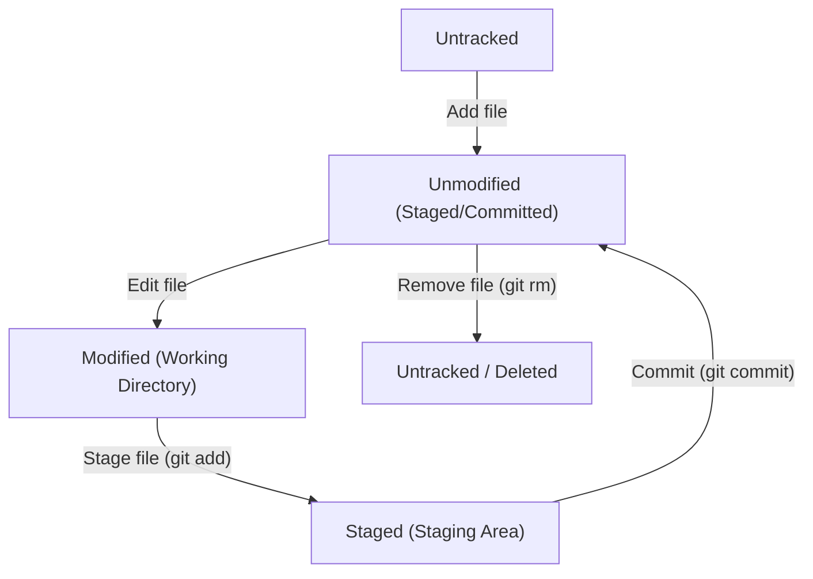
> Staging area and index are synonyms.

<!-- end_slide -->

IGNORE DATA YOU DO NOT WANT TO TRACK! (`.gitignore`)
===

In Git you can use one or many `.gitignore` files to **ignore** files you do not want to track (it is a *hidden* file).
Notoriously annoying files are editor backup files (`*~`, `*.bak`, `*.swp`), object files of compiled languages (`*.o`), and OS-specific files like `.DS_Store` or the `__MACOSX__` directory.

Example `.gitignore` content:
```gitignore
# you can use comments too!
__pycache__/     # this ignores a whole directory
*.bak            # name of backup files
*~               # some editors create backup files ending with '~'
*.pyc            # pre-compiled Python bytecode (not portable)
!important.py    # except any file with the .py suffix, if named important.py
```
> It is **essential that you keep your repository clean**, the `.gitignore` file is the key to a clean repository.

<!-- end_slide -->

BRANCHES
===

<!-- end_slide -->

BRANCHES - The Main Tool
===

*   Branches are **THE main tool** for development.
*   Whenever you think about testing something out, the first thing you do is create a new branch. You can just **discard** the branch if it does not work.
*   Historically, branching is an expensive task in VCS, **not in Git!**
    *   **Recall:** blobs, trees and commits is what Git cares about.
    *   The reference of a branch simply is a commit reference (a pointer to a *file system snapshot*).

<!-- end_slide -->

BRANCHES - Example Scenario
===

Assume you have a new repository and you just created the initial commit A:
```
A (main)
```
> In the following the pointer denoted `main` points to the *head commit* of the branch `main`. Currently, this is commit `A`.

Now suppose we make two more commits B and C. The pointer that describes the `main` branch moves along:
```
A -- B -- C (main)
```
At this point in your development process, you notice a strange behavior of your code and you suspect that a bug has been introduced.
**How to proceed now?**

<!-- end_slide -->

BRANCHES - Creating a Bugfix Branch
===

You can continue on `main` but this is **not a good idea**. Fixing bugs requires you to throw things around. Create a new branch `bugfix1`:
```bash
$ git switch -c bugfix1   # the -c option creates the branch if it does not exist
# Or: git checkout -b bugfix1
```
Our revision timeline now looks like this:
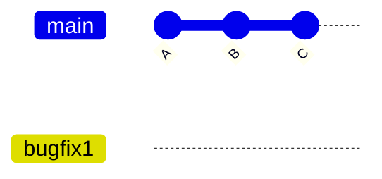
*   branch point is C
*   bugfix1 is now the active branch (what HEAD points to)

<!-- end_slide -->

BRANCHES - HEAD Pointer & Working on Bugfix
===

Our revision timeline:
```
A---B---C (main)
         \
          (bugfix1)  <- HEAD
```
> There is a special pointer in Git called **HEAD**. It always points to the *currently active branch* (or a specific commit in "detached HEAD" state).

Now we do some work to fix this bug. Assume the next two commits D and E implement these fixes on `bugfix1`:
```
A---B---C (main)
         \
          D---E (bugfix1) <- HEAD
```
We also switched back to the `main` branch with `git switch main`.
Which commit reference will `HEAD` now point to? (Answer: `C` on `main`)
After `git switch main`:
```
A---B---C (main) <- HEAD
         \
          D---E (bugfix1)
```

_Mermaid Diagram for state after D and E on bugfix1:_
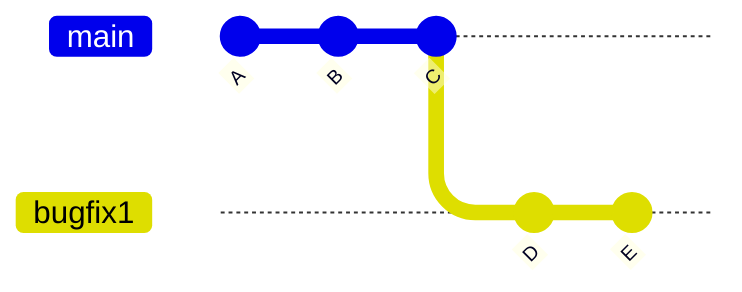

<!-- end_slide -->

BRANCHES - Merging (Fast-Forward vs. Merge Commit)
===

We have tested our changes on the `bugfix1` branch and things work as expected. We switched back to the `main` branch as we would like to **merge** the history of `bugfix1` into `main`.

Current state:
```
A---B---C (main) <- HEAD
         \
          D---E (bugfix1)
```
Because there are **no new commits** on `main` since we branched off `bugfix1`, the merge is trivial.
Git has two options:
1.  Fold `bugfix1` and `main` together (**fast-forward merge**)
2.  Create a **merge commit** which joins `bugfix1` and `main` in a common commit.

<!-- end_slide -->

BRANCHES: FF MERGE (Fast-Forward)
===

Situation *before* merge (on `main`):
```
A---B---C (main) <- HEAD
         \
          D---E (bugfix1)
```
**Fast-Forward merge:** this is the default that Git assumes if possible.
Command (while on `main`): `git merge bugfix1` (or `git merge --ff bugfix1`)

After the fast-forward merge your history looks like this:
```
A---B---C---D---E (main) <- HEAD
               /
            (bugfix1) # this branch pointer is now effectively redundant for main's history
```
The `bugfix1` branch is now *fully* merged in `main`. It is no longer needed for `main`'s linear history and good practice to remove it: `git branch -d bugfix1`
Final state:
```
A---B---C---D---E (main) <- HEAD
```
_Mermaid Diagram:_
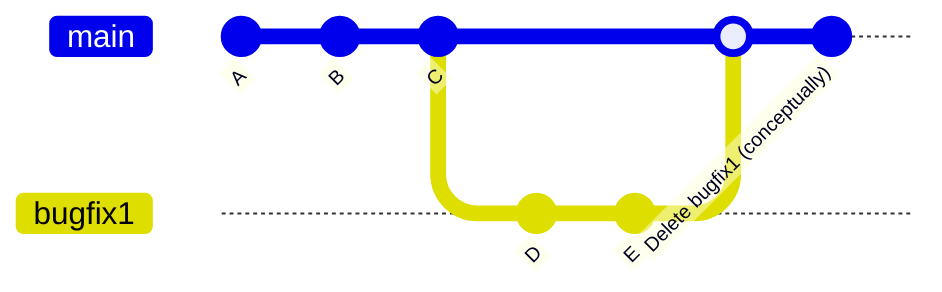

<!-- end_slide -->

BRANCHES: MERGE COMMIT (`--no-ff`)
===

Situation *before* merge (on `main`):
```
A---B---C (main) <- HEAD
         \
          D---E (bugfix1)
```
**Merge with new commit:** this type of merge creates a common commit for the merge (it will have 2 parents!).
Command (while on `main`): `git merge --no-ff bugfix1`

After creating a merge commit F, your history looks like this:
```
A---B---C-------F (main) <- HEAD
         \     /
          D---E (bugfix1)
```
Same rule for cleaning: `git branch -d bugfix1`
Final state (after deleting `bugfix1` branch pointer):
```
A---B---C-------F (main) <- HEAD
         \     /
          D---E
```
_Mermaid Diagram:_
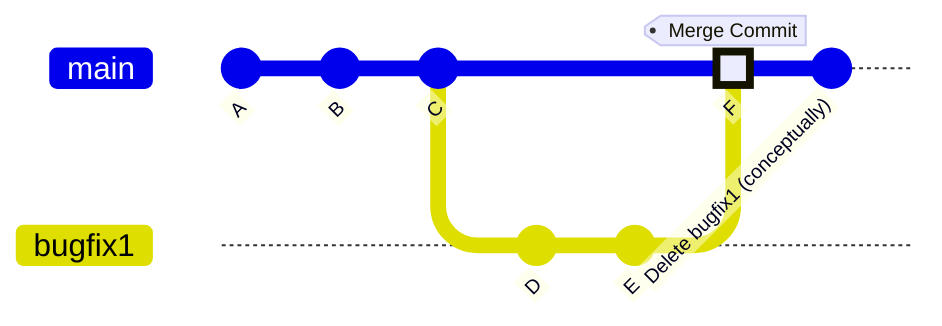

<!-- end_slide -->

BRANCHES: Comparing Merge Strategies (`git log --oneline --graph`)
===

Compare the difference of the two approaches:

**Fast-Forward:**
```
$ git log --oneline --graph
* 57f4883 (HEAD -> main) Commit E
* d5278fb Commit D
* 9cb047b Commit C
* b51859a Commit B
* 2c1f77c Commit A
```
History: `A---B---C---D---E (main)` (Linear history)

**Merge-commit:**
```
$ git log --oneline --graph
*   4466977 (HEAD -> main) Merge branch 'bugfix1' (Commit F)
|\
| * 57f4883 Commit E
| * d5278fb Commit D
|/
* 9cb047b Commit C
* b51859a Commit B
* 2c1f77c Commit A
```
History: `A---B---C-------F (main)` (Non-linear history, preserves branch structure)
                ` \     /`
                 `  D---E`

*   Some people argue that creating merge commits adds **noise** to your history (technically they are not needed if a fast-forward is possible).
*   Merge commits **preserve your branching history**, which may be useful for a better understanding of the development process.
*   Some projects have requirements for how commits are merged.

<!-- end_slide -->

STASH
===

Assume you find yourself in this situation:
```
A---B---C (main)
         \
          D-* (bugfix1) <- HEAD, * means modified files
```
**Common scenario:** you stop work on the `bugfix1` branch temporarily and need to switch to some other branch (say `main`). Your work on `bugfix1` is not ready to be committed yet.

You can use `git stash` to temporarily stash your changes away.
```bash
git stash push -m "WIP on bugfix1 feature X" # Stashes changes
git switch main
# ... do work on main ...
git switch bugfix1
git stash pop # Restores stashed changes (and removes from stash list)
# Or: git stash apply (keeps in stash list)
```

<!-- end_slide -->

REBASE A HISTORY TO MAINTAIN LINEARITY
===

Let's return to our previous state but now **we have a collaborator who did work** on `main` in the meantime (commit labels A, B,... are only symbolic).
```
A---B---C---D---E (main)
         \
          F---G (bugfix1) <- HEAD
```
_Mermaid Diagram:_
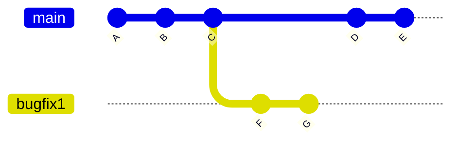
_Can you apply a fast-forward merge strategy in this case?_
> **You can not!** (Because `main` has diverged). Remember, once a history is recorded by computing the SHA-1 hash, we can not change it anymore (easily, for shared history).

There are two options:
1.  Merge via a **merge commit** (as before, will create a merge commit like F on the previous slide example).
2.  If `bugfix1` is a branch that **only exists in your local** `.git` repository, we can **rebase** and therefore *rewrite the local history* (nobody has seen your local history yet). This a **powerful feature of Git.**

<!-- end_slide -->

REBASE: CASE 1 - Merge Commit (Standard Merge)
===
Current state (on `bugfix1`):
```
A---B---C---D---E (main)
         \
          F---G (bugfix1) <- HEAD
```
**Merge via merge commit:** same as in the previous case where work on main did not advance *relative to the merge base*.
1.  `git switch main` (change to the target branch)
2.  `git merge bugfix1` (merge into main)
3.  `git branch -d bugfix1` (clean up)

Resulting history (after merge commit H):
```
A---B---C---D---E-------H (main) <- HEAD
         \         /
          F-------G (bugfix1)
```
_Mermaid Diagram:_
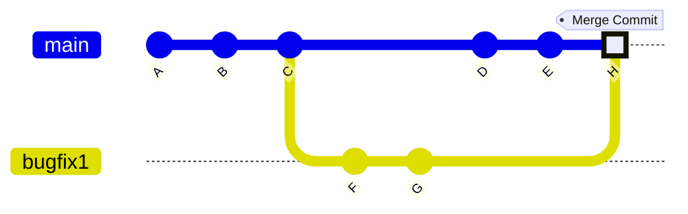

<!-- end_slide -->

REBASE: CASE 2 - Rebase and Fast-Forward Merge
===
Current state (on `bugfix1`):
```
A---B---C---D---E (main)
         \
          F---G (bugfix1) <- HEAD
```
**Rebase and merge:** here we first **rebase** our `bugfix1` branch *onto* the advanced `main` branch and then use a fast-forward merge to *linearize* the history.

1.  (While on `bugfix1`): `git rebase main` (rewriting `bugfix1` history, i.e., new commits F' and G' are created!)

```
A---B---C---D---E (main)
                 \
                  F'---G' (bugfix1) <- HEAD

```

*   Commits F' and G' have a **different SHA-1** than F and G, therefore, history is rewritten!
*   Their time stamp remains the same, but parents change.

2.  `git switch main` && `git merge bugfix1` (merge into main as usual - this will be a fast-forward)
```
A---B---C---D---E---F'---G' (main) <- HEAD
                           \
                            (bugfix1) # now dangling
```
Clean up with `git branch -d bugfix1`.

_Mermaid Diagram (Step 1 - after rebase):_


<!-- end_slide -->

REBASE - Cautionary Notes
===
> `git rebase` unwinds commits and re-applies them on top of another commit. Naturally, this **changes your history**. It is a powerful tool for *local* history transformations.

*   Rebased histories can have commit time stamps that are *not* in chronological order but allow you to maintain a linear history.
*   Rebasing allows to *linearize* your history.
*   Some projects are very strict about how you must maintain the history of the project. Be sure to check them out before collaborating.

> **Warning:** You can put yourself in a bad light if you rebase a history and (forcefully!) push it to a remote where others can pull from as well. Git will not allow you to do this by default (`git push` will be rejected), but you can force it with `git push --force`. It will *invalidate* the history in all your collaborators' local repositories. You can always rewrite history *locally* or use a forced push **iff you are the *only one*** working with the (remote) branch. **Never rebase commits that have been pushed to a shared branch.**

<!-- end_slide -->

QUESTIONS?
===

<!-- end_slide -->

QUESTIONS (How to learn)
===

*   How can I learn all of this?
    *   Homework, section and projects.
    *   Practice, practice, practice!
    *   Use a visual tool (like `gitk`, Sourcetree, VS Code Git Graph) to understand what commands are doing to the commit graph.
    *   [Pro Git Book](https://git-scm.com/book/en/v2) (free online)
    *   [Learn Git Branching (Interactive Tutorial)](https://learngitbranching.js.org/)

<!-- end_slide -->
